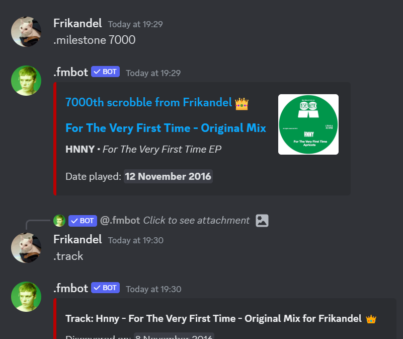

# Miscellaneous

### Deleting fmbot responses

It's possible to remove .fmbot's response, even if you don't have permission to manage messages.

Mobile: Long press message > Apps > Delete response

Desktop: Right-click message > Apps > Delete response

---

### Reply context

You can reply to any fmbot command or response that contains an artist, album or track to directly use that as context for your new command.

Example below:

{ loading=lazy }

---

### .judge

Judges your music taste using AI. You can pick between either a compliment or a roast.

Options:

* Time period - Time period of your top artists. Defaults to weekly.
* User - Select another user by mention, Discord ID or Last.fm username (`lfm:username`)

!!! note "Examples"
    `.judge`

!!! info ""
    Supporters get access to higher quality compliments and roasts, generated with a better language model. [Get .fmbot supporter here.](../supporter.md)

!!! note ""
    The usage limits for this command might be adjusted depending on popularity and cost.

---

### .rateyourmusic

Enables/disables an option that changes all album links to link to RateYourMusic.

!!! note "Examples"
    `.rym`

---

### .info

Shows all the information and links related to the bot.

!!! note "Examples"
    `.info`

---
### .status

Gets the bot status information.

!!! note "Examples"
    `.status`

---
### .eurovision (`.ev`)

Shows Eurovision Song Contest information for a specific year or country.

Options:

* Year - Year you want to view. Defaults to current year.
* Country - A country you want to view.

!!! note "Examples"
    `.ev`

    `.eurovision`

    `.eurovision 2024`

    `.eurovision Sweden`

---
### .remove

Deletes all your user information, including all your friends and other settings.

!!! note "Examples"
    `.remove`

